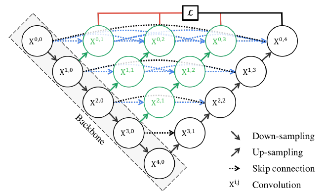

# Lung Cancer Detection

## Overview

This project focuses on **lung cancer detection** using **CT scans** from the **Lung Image Database Consortium and Image Database Resource Initiative (LIDC-IDRI)**. The goal is to develop robust deep learning models for detecting and diagnosing lung nodules indicative of cancer.

## Dataset Description

The **LIDC-IDRI dataset** serves as a benchmark for developing computer-assisted diagnostic methods for lung cancer detection. It contains **annotated thoracic CT scans** reviewed by expert radiologists.

- **Total Patients:** 1,010
- **Data Types:**  
  - **Diagnostic (DX)**
  - **Computed Tomography (CT)**
  - **Chest Radiography (CR)**
- **Cancer Categories:**  
  - Lung Cancer  
  - Non-Cancer  
  - Metastatic Disease
- **Total Images:** 244,527
- **Total Dataset Size:** 133.16 GB
- **Annotations:**  
  - Provided in **XML format** by radiologists through a two-phase review process.

## Models Tested

### **1. UNet**  
- 

### **2. Nested UNet**  
- 

## Model Weights

Pre-trained model weights can be accessed here:  
🔗 [Google Drive - Model Weights](https://drive.google.com/drive/folders/1RuOPZ8Vz3jMhm26IGI948hIy6pRDaETl?usp=drive_link)

## Data Access

The dataset and annotation files can be downloaded from **The Cancer Imaging Archive (TCIA):**  
🔗 [LIDC-IDRI Dataset](https://doi.org/10.7937/K9/TCIA.2015.LO9QL9SX)

**Note:** Annotation files (XML format) are essential for understanding radiologist markings.

---
